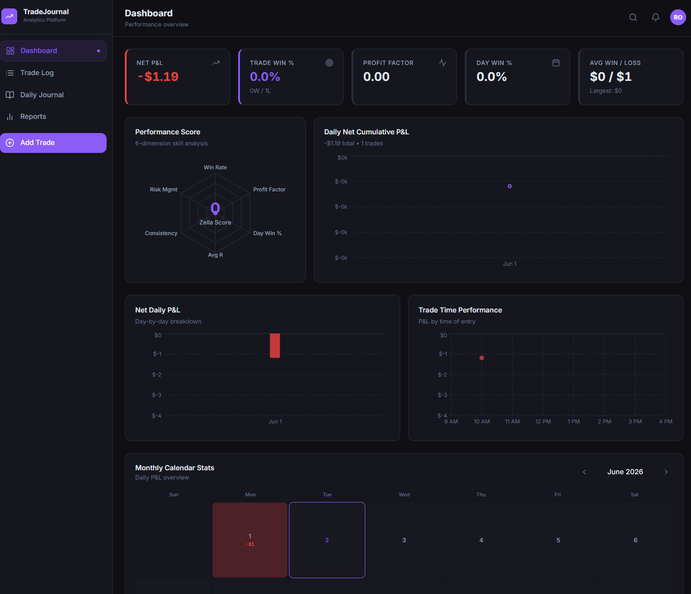

# TradeJournal — Advanced Trading Journal & Analytics Platform



TradeJournal is a premium, high-performance web application designed for active traders to log trades, journal daily performance, track metrics, and analyze real-world spot price charts. 

Built with **Next.js (App Router)**, **TypeScript**, **MongoDB/Mongoose**, and **Redux Toolkit**, it delivers a seamless, multi-tenant interface with secure cookies, Edge-safe authentication, and spotlight global search.

---

## Key Features

- 📊 **Multi-Asset Trade Logger**: Fully supports **Forex**, **Indices**, **Stocks**, **Crypto**, and **Futures** with decimal lots (fractional quantity support).
- 🎯 **Advanced Risk Analytics**: Automatic calculation of **Stop Loss**, **Take Profit**, **Initial Risk** (absolute dollars and percentage of position), and **R-Multiple** metrics.
- 📈 **Real-World Spot Candlestick Charts**: Integrated Yahoo Finance proxy mapping CFD/Futures symbols (e.g., `EURUSD`, `SPX500`, `XAUUSD`, `MGC`, `MNQ`) directly to spot quotes. Includes dynamic margin scaling to keep candle counts constant across all resolutions (1m, 5m, 15m, 30m, 1h, 1d).
- 📓 **Daily Performance Journaling**: Rich-text TipTap journaling panels, mood triggers, daily goals, and lessons learned dashboards.
- 🔍 **Spotlight Global Search**: Keyboard-accessible (`Cmd/Ctrl + K`) global search query command palette.
- 🔔 **System Alerts & Notifications**: Floating popover alerts highlighting account milestones and welcome messages.
- 🔒 **Security & Multi-Tenancy**: Protected edge middleware utilizing HTTP-only cookie JWT validations and isolated user database partitions.

---

## Technical Stack

- **Frontend**: Next.js 16 (App Router), Tailwind CSS (Harmonious dark mode palette), Lucide Icons
- **State Management**: Redux Toolkit (RTK)
- **Backend & Database**: Next.js Serverless Route Handlers, MongoDB, Mongoose
- **Charting Engine**: Lightweight Charts (TradingView)
- **Authentication**: JWT signed via `jose`, HTTP-only secure cookie storage, bcryptjs password hashing

---

## Environment Setup

Create a `.env.local` file at the root directory with the following variables:

```bash
# MongoDB Connection URI
MONGODB_URI=mongodb://localhost:27017/tradejournal

# Secret key used for signing JWT cookies (min 32 characters)
JWT_SECRET=your_jwt_secret_key_here

# JWT cookie duration (e.g., 7 days)
JWT_EXPIRES_IN=7d

# True if deploying over HTTPS, false for localhost
COOKIE_SECURE=false
```

---

## Installation & Running

1. **Clone & Install Dependencies**:
   ```bash
   bun install
   # or
   npm install
   ```

2. **Run Dev Server**:
   ```bash
   bun run dev
   # or
   npm run dev
   ```
   Open [http://localhost:3000](http://localhost:3000) to log in or register.

3. **Production Build**:
   ```bash
   bun run build
   bun run start
   ```

---

## Who is this for?

TradeJournal is built for **professional and retail traders** (trading Forex, futures contracts, equities, or crypto indices) who need a rigorous framework to log trades, review performance, analyze risk execution, and build a consistent trading process.
